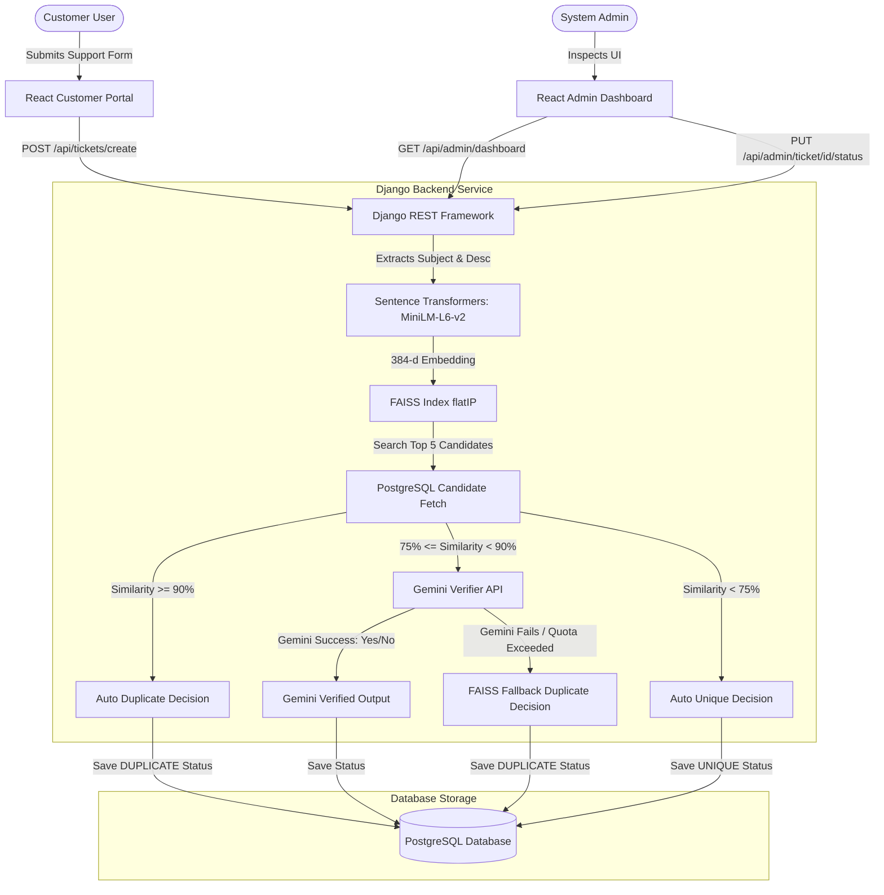

# Smart Issue Tracker: Hybrid AI Duplicate Ticket Detection & Management System

[](https://djangoproject.com/)
[](https://reactjs.org/)
[](https://www.typescriptlang.org/)
[](https://www.postgresql.org/)
[](#)
[](https://deepmind.google/technologies/gemini/)

A high-performance, enterprise-grade Support Ticketing portal built on a modern hybrid architecture. It integrates **Dense Vector Embeddings** (FAISS) with **Generative AI** (Google Gemini) to detect, link, and manage duplicate support ticket submissions in real time.

---

## Quick Start

### Backend

```bash
git clone <repo-url>
cd <project-folder>

python -m venv venv
# On Windows:
venv\Scripts\activate
# On macOS/Linux:
# source venv/bin/activate

pip install -r requirements.txt

python manage.py migrate
python manage.py runserver
```

### Frontend

```bash
npm install
npm run dev
```

---

## Project Overview

### The Problem
Customer support departments in growing enterprises are routinely inundated with duplicate ticket submissions. Whether it is a widespread service outage ("Cannot log in"), recurring billing problems, or individual user mistakes ("Password wrong"), multiple users submit virtually identical reports. 
Manually identifying, grouping, and linking duplicates:
- Consumes valuable support representative time.
- Artificially inflates backlog metrics.
- Delays response times for unique, high-priority issues.
- Prevents accurate measurement of incident severity based on user report volumes.

### The Solution
The **Smart Issue Tracker** automates duplicate detection. It combines dense semantic vector representation with structured Large Language Model validation. When a customer submits a ticket:
1. It is converted into a semantic embedding.
2. It is matched against database records via vector indexing to find highly similar issues.
3. Depending on the similarity score, it is either marked as a duplicate automatically, routed to Gemini AI for verification, or classified as a unique master ticket.
4. Linked duplicate submissions automatically increment the supporter counts of their master tickets rather than cluttering support grids, allowing teams to immediately prioritize issues by customer impact.

---

## Features

- **Ticket Submission Portal**: Simple, elegant markdown-ready intake form for end-users to submit support requests dynamically categorizing tickets.
- **Hybrid Duplicate Issue Detection**: Employs a multi-tier classification workflow using vector distance checks combined with LLM validation.
- **FAISS Vector Similarity Search**: Utilizes `sentence-transformers/all-MiniLM-L6-v2` to map ticket subjects and descriptions into 384-dimensional dense vectors, searching against a local FAISS flat inner-product index.
- **Gemini AI Verification**: Performs verification using the `gemini-1.5-flash` model with structured schema compilation to confirm semantic equivalence, complete with connection/quota retries and exponential backoffs.
- **Automatic Duplicate Linking**: Matches duplicates and links them directly to the master ticket using parent-child relational mappings.
- **Admin Dashboard**: Visualizes processing counters, duplicate matches, monthly volume changes, monthly metrics, and daily distribution timelines.
- **Analysis History Log**: Details exact decision flows, verdicts, matched codes, similarity percentages, and LLM reasoning logs.
- **Categories Management**: Dynamic CRUD management for support domains (e.g. Authentication, Billing, General) annotated with live ticket statistics and duplication rates.
- **Ticket Management**: Interface to review, assign support tiers, update statuses, and override AI decisions (marking duplicates as unique or vice-versa).
- **Session-Based Authentication**: Secure session authentication utilizing Django REST Framework permissions tailored for custom administrative user roles.

---

## System Architecture

The application is structured as a decoupled SPA-API layout, utilizing React on the frontend and Django REST Framework on the backend, communicating over a JSON API.



### Architecture Component Details
1. **Frontend Layer**: Created using Vite, React, TypeScript, and Tailwind CSS. The dashboard makes relative proxy API requests, passing session headers to authenticate administration operations.
2. **Backend Services**: A Django server exposing REST resources. A custom `TicketSubmissionService` orchestrates the coordinate vector and LLM verification pipelines.
3. **AI & Vector Search Layer**: Uses HuggingFace's sentence-transformers to generate localized vectors. Vector indexing and searching are performed locally by FAISS.
4. **LLM Verification Layer**: Employs Google's Generative AI SDK, parsing comparisons against a structured Pydantic response schema to return deterministic outputs.
5. **Database Layer**: Implemented using PostgreSQL for persistent storage. Relational integrity is maintained between categories, tickets, embedding references, and history audit logs.

---

## Technology Stack

### Frontend
- **React 18**: Component-driven SPA user interface.
- **TypeScript**: Typed safety across routes, states, and API payloads.
- **Vite**: Rapid asset bundle packaging and hot-reload local server.
- **Tailwind CSS**: Modern layout engine with custom styling components.
- **Lucide React**: Vector icons and design components.

### Backend
- **Django 5**: Secure, batteries-included web framework.
- **Django REST Framework (DRF)**: Web-API serialization and permissions filtering.
- **Corsheaders**: Resolves Cross-Origin Resource Sharing (CORS) configurations.

### AI & NLP Layer
- **FAISS (cpu)**: Facebook AI Similarity Search Flat Inner Product index for cosine similarity queries.
- **Sentence-Transformers**: Compact, CPU-efficient sentence embedding model (`all-MiniLM-L6-v2`).
- **Google Generative AI**: Accesses Gemini models using GenerationConfig schema interfaces.

---

## Project Workflow

```
Customer Submits Support Request Form
  │
  ▼
Backend Concatenates: "Category: ... \nSubject: ... \nDescription: ..."
  │
  ▼
Sentence-Transformers Maps Text to a 384-dimensional Vector (L2 Normalized)
  │
  ▼
FAISS Search Executes against Existing Master Ticket Vectors (L2 Normalized)
  │
  ▼
Candidate Selection: Finds closest matching active ticket in same Category
  │
  ▼
┌─────────────────────────── Check Similarity Score ───────────────────────────┐
│                                                                              │
│  Similarity >= 90%           75% <= Similarity < 90%          Similarity < 75%
│        │                                │                            │
│        ▼                                ▼                            ▼
│  Auto Duplicate                  Gemini Verifier               Auto Unique
│        │                                │                            │
│        │                  ┌─────────────┴─────────────┐              │
│        │            Gemini Available             Gemini Fails        │
│        │                  │                           │              │
│        │            ┌─────┴─────┐                     ▼              │
│        │        Match=Yes    Match=No          FAISS Fallback        │
│        │            │           │                 Duplicate          │
│        ▼            ▼           ▼                     │              ▼
│  [DUPLICATE]   [DUPLICATE]   [UNIQUE]           [DUPLICATE]       [UNIQUE]
└────────┬────────────┬───────────┼─────────────────────┬──────────────┬───────┘
         │            │           │                     │              │
         ▼            ▼           ▼                     ▼              ▼
   (Update Master,   (Update Master, (Save new Ticket,  (Update Master,  (Save new Ticket,
    Save duplicate    Save duplicate  Create FAISS vectorSave duplicate  Create FAISS vector
    record & history) record & history) index & history) record & history) index & history)
         │                                                             │
         └─────────────────────────────────────────────────────────────┘
                                        │
                                        ▼
                             Dashboard Charts Update
```

---

## Duplicate Detection Logic

The hybrid pipeline handles comparisons through four logical rules based on vector similarity and model availability:

### Rule A: Auto Duplicate (Similarity $\ge 90\%$)
If the cosine similarity score between the new ticket and the best candidate is $90\%$ or above, the ticket is classified as a duplicate automatically. No Gemini API request is performed, saving quota and processing time.
- **Example**:
  - Existing Ticket: *"Cannot login to portal"*
  - New Ticket: *"Cannot login to the portal"*
  - Vector Similarity: $97.2\%$
  - Action: Automatically merged. `decision_flow="Auto Duplicate (90%+)"`.

### Rule B: Gemini Verification ($75\% \le \text{Similarity} < 90\%$)
If the similarity is between $75\%$ and $90\%$, it requires semantic context analysis. The ticket metadata is sent to Gemini AI along with a structured response schema. Gemini's response determines the classification.
- **Example**:
  - Existing Ticket: *"Unable to reset password after changing email"*
  - New Ticket: *"Password reset links are failing to arrive in outlook"*
  - Vector Similarity: $81.5\%$
  - Gemini Output: `same_issue = True`, `confidence = 90%`.
  - Action: Merged as duplicate. `decision_flow="Gemini Verified"`.

### Rule C: FAISS Fallback Duplicate (Similarity $\ge 75\%$, Gemini Fails)
If the similarity is $75\%$ or above, but the Gemini API is unavailable (connection error, rate limit, or disabled), the system falls back to the FAISS vector search results to avoid failing the ingestion pipeline. The ticket is classified as a duplicate.
- **Example**:
  - Existing Ticket: *"Database connection timeout on write"*
  - New Ticket: *"App crashes with write timeout database error"*
  - Vector Similarity: $86.4\%$
  - Gemini Output: `DefaultCredentialsError` / `429 ResourceExhausted`
  - Action: Merged as duplicate. `decision_flow="FAISS Fallback Duplicate"`.

### Rule D: Unique (Similarity $< 75\%$)
If the similarity score is below $75\%$, the ticket describes a separate issue. The ticket is saved as a new master ticket.
- **Example**:
  - Existing Ticket: *"Cannot log in"*
  - New Ticket: *"Pricing page billing links are broken"*
  - Vector Similarity: $15.4\%$
  - Action: Created as a new unique issue. `decision_flow="FAISS Only"`.

---

## Database Design

The schema is configured for PostgreSQL and models the following entities:

```
                  ┌──────────────┐
                  │  AdminUser   │
                  └──────┬───────┘
                         │ 1
                         │
                         │ 1
                  ┌──────▼───────┐
                  │  Supporter   │
                  └──────┬───────┘
                         │ 1
                         │
                         │ 0..*
┌──────────────┐  │   ┌──▼────────────────────────────┐
│   Category   ├──┼───┤            Ticket             │
└──────┬───────┘  │   └───┬─────────────┬───────────┬─┘
       │ 1        │       │ 1           │ 1         │ 1
       │          │       │             │           │
       │ 0..*     │       │ 1           │ 1         │ 0..1
┌──────▼───────┐  │   ┌───▼──────────┐  │ ┌─────────▼────────┐
│    Ticket    ├──┘   │  Embedding   │  │ │ TicketHistory    │
└──────────────┘      │  Reference   │  │ └──────────────────┘
                      └──────────────┘  │
                                        │ 0..* (Self-Relation)
                                        └──► parent_ticket
```

### Models and Fields

#### 1. `Category`
Maintains categorization definitions for ticketing support.
- `id` (BigAutoField, PK)
- `name` (CharField, unique)
- `slug` (SlugField, unique, indexed)
- `icon_name` (CharField) - Lucide icon lookup code.
- `created_at` / `updated_at` (DateTimeField)

#### 2. `AdminUser`
Custom user model extending Django's standard `AbstractUser`.
- `email` (EmailField, unique)
- `first_name` / `last_name` (CharField)

#### 3. `TicketSupporter`
Profile of support agents, mapping support tiers and capacity metadata.
- `id` (BigAutoField, PK)
- `user` (OneToOneField -> `AdminUser`)
- `tier` (CharField, Choices: L1, L2, L3)
- `is_available` (BooleanField)

#### 4. `Ticket`
Represents customer reports and maintains parent-child duplicate mappings.
- `id` (BigAutoField, PK)
- `ticket_code` (CharField, unique, indexed) - Auto-generated identifier (e.g. `T-8005`).
- `first_name` / `last_name` (CharField)
- `category` (ForeignKey -> `Category`)
- `subject` (CharField)
- `description` (TextField)
- `status` (CharField, Choices: `UNIQUE`, `DUPLICATE`, `PENDING_REVIEW`)
- `parent_ticket` (ForeignKey -> `self`, null=True) - Points to the master ticket.
- `assigned_supporter` (ForeignKey -> `TicketSupporter`, null=True)
- `supporter_count` (PositiveIntegerField) - Increments for every linked duplicate ticket.

#### 5. `EmbeddingReference`
Persists serialized float arrays representing text embeddings.
- `ticket` (OneToOneField -> `Ticket`)
- `embedding` (JSONField) - Serialized 384-float vector.
- `model_name` (CharField)

#### 6. `TicketHistory`
Maintains the audit log of system verdicts, status transitions, and user logs.
- `id` (BigAutoField, PK)
- `ticket` (ForeignKey -> `Ticket`)
- `action` (CharField, Choices: `INGESTION`, `DUPLICATE_REPORTED`, `DUPLICATE_LINKED`, `MANUAL_OVERRIDE_UNIQUE`, `STATUS_CHANGE`)
- `actor` (ForeignKey -> `AdminUser`, null=True)
- `notes` (TextField)
- `metadata` (JSONField) - Stores decision flow stats, LLM justification, and verification details.

---

## API Documentation

The backend services expose standard endpoints for both public operations and admin operations:

| Method | Endpoint | Auth Required | Description |
| :--- | :--- | :--- | :--- |
| **POST** | `/api/auth/login` | No | Authenticates administrator sessions. |
| **POST** | `/api/auth/logout` | Yes | Wipes current session authentication headers. |
| **GET** | `/api/auth/me` | Yes | Retrieves authenticated user account details. |
| **POST** | `/api/tickets/create` | No | Submits support ticket and runs deduplication. |
| **GET** | `/api/tickets` | No | Paginated list of tickets. Supports filter params (`?q=`, `?status=`). |
| **GET** | `/api/tickets/<str:id>` | No | Ticket details (lookup via database PK or ticket code). |
| **GET** | `/api/categories` | No | Category listings with annotations (counts/rates). |
| **POST** | `/api/categories` | Yes | Creates a new support category. |
| **PUT** | `/api/categories/<int:pk>` | Yes | Updates category properties. |
| **DELETE** | `/api/categories/<int:pk>`| Yes | Deletes a category. |
| **GET** | `/api/admin/dashboard` | Yes | Summary counts, Monthly stats, and Activity logs. |
| **PUT** | `/api/admin/ticket/<int:id>/status`| Yes | Modifies ticket status flags and adjusts FAISS index. |
| **GET** | `/api/admin/trending` | Yes | Retrieves duplicate rates sorted by categories. |
| **GET** | `/api/admin/history` | Yes | Paginated analysis history audits listing. |

---

## Dashboard Metrics

The administrator dashboard provides access to six primary metric summaries:
1. **Total Tickets**: Total support tickets submitted to the platform.
2. **Duplicate Matches**: Count of duplicate submissions identified by the pipeline.
3. **Categories**: The number of active service domains.
4. **Average Similarity Score**: The average matching score computed from all verified duplicate ticket events.
5. **Processing Volume**: Weekly chart plotting total ticket volume alongside identified duplicates.
6. **Recent Activity**: Activity log detailing recent analysis classifications, status changes, and overrides.

---

## Installation Guide

### Prerequisites
- Python 3.10+
- Node.js 18+
- PostgreSQL database server (optional, falls back to local database or env keys)

---

### Backend Setup

1. **Clone and navigate to the project directory**:
   ```bash
   cd issue-tracker
   ```

2. **Initialize a virtual environment**:
   ```bash
   python -m venv venv
   venv\Scripts\activate
   ```

3. **Install dependencies**:
   ```bash
   pip install -r requirements.txt
   ```

4. **Set environment configurations**:
   Configure environment variables inside a `.env` file or export them directly (see the Environment Variables section).

5. **Perform database migrations**:
   ```bash
   python manage.py migrate
   ```

6. **Create a superuser account**:
   ```bash
   python manage.py createsuperuser
   ```

7. **Start the backend server**:
   ```bash
   python manage.py runserver
   ```

---

### Frontend Setup

1. **Navigate to the frontend directory**:
   The frontend code resides in the root and `src` directories.

2. **Install Node packages**:
   ```bash
   npm install
   ```

3. **Start the development hot-rebuild server**:
   ```bash
   npm run dev
   ```

The application will be accessible at:
- User intake portal: `http://localhost:5173/`
- Administrative dashboard: `http://localhost:5173/admin`

---

## Environment Variables

Configure these settings inside the environment or a local `.env` file at the root:

| Variable | Type | Default Value | Description |
| :--- | :--- | :--- | :--- |
| `GEMINI_API_KEY` | String | *Empty* | API key for Gemini AI. |
| `GEMINI_ENABLED` | Boolean| `True` | Set to `False` to disable LLM verifications. |
| `GEMINI_MODEL_NAME`| String | `gemini-1.5-flash` | The Gemini model used for verification. |
| `DJANGO_DEBUG` | Boolean| `True` | Set to `False` for production deployments. |
| `DJANGO_SECRET_KEY`| String | *Development Key*| Django cryptography secret key. |
| `POSTGRES_DB` | String | `smart_issue_tracker` | Database name. |
| `POSTGRES_USER` | String | `postgres` | Database username. |
| `POSTGRES_PASSWORD`| String | `root1234` | Database password. |
| `POSTGRES_HOST` | String | `127.0.0.1` | Database host. |
| `POSTGRES_PORT` | String | `5432` | Database port. |
| `DEDUPLICATION_SIMILARITY_THRESHOLD` | Float | `0.75` | Minimum similarity for duplicate checks. |
| `DEDUPLICATION_CONFIDENCE_THRESHOLD` | Integer | `80` | Gemini confidence threshold (0-100). |

---

## Screenshots Section

> [!NOTE]
> Below are representative mock layouts of the application dashboard and user portal pages.

### User Ticket Submission Page
```
+--------------------------------------------------------------------------+
|  SMART ISSUE TRACKER - CUSTOMER INTAKE PORTAL                            |
+--------------------------------------------------------------------------+
|  Submit a support ticket:                                                |
|  Category:   [ Authentication | v ]                                      |
|  Subject:    [ Unable to login using my email                           ] |
|  Description:                                                            |
|  [ I get a 403 Forbidden error every time I try to submit my password   ] |
|  [ page after resetting. Please advise.                                 ] |
|                                                                          |
|  [ Submit Ticket Button ]                                                |
+--------------------------------------------------------------------------+
```

### Admin Dashboard Overview
```
+--------------------------------------------------------------------------+
|  DASHBOARD OVERVIEW                                        Admin User    |
+--------------------------------------------------------------------------+
|  [Total Tickets: 104]  [Duplicates: 22]  [Avg Similarity: 84.6%]          |
|                                                                          |
|  Weekly Processing Volume:                                               |
|  Tickets:    ======================== (104)                              |
|  Duplicates: ===== (22)                                                  |
|                                                                          |
|  Recent Activity:                                                        |
|  - T-8024 classified as DUPLICATE of T-8001 (FAISS Fallback Duplicate)   |
|  - T-8023 classified as DUPLICATE of T-8001 (FAISS Fallback Duplicate)   |
+--------------------------------------------------------------------------+
```

### Previous Tickets Grid
```
+--------------------------------------------------------------------------+
|  SUPPORT TICKETS LIST                                                    |
+--------------------------------------------------------------------------+
|  Code   │ Subject                  │ Status    │ Master    │ Date        |
|  ───────┼──────────────────────────┼───────────┼───────────┼─────────────|
|  T-8001 │ Login Failed             │ Unique    │ -         │ Jun 09, 2026|
|  T-8022 │ Login Problem            │ Duplicate │ T-8001    │ Jun 09, 2026|
|  T-8023 │ unable to login          │ Duplicate │ T-8001    │ Jun 09, 2026|
+--------------------------------------------------------------------------+
```

### Analysis History Audits
```
+--------------------------------------------------------------------------+
|  ANALYSIS AUDITS HISTORY                                                 |
+--------------------------------------------------------------------------+
|  New Ticket │ Matched  │ Similarity │ Verdict   │ Decision Flow          |
|  ───────────┼──────────┼────────────┼───────────┼────────────────────────|
|  T-8022     │ T-8001   │ 88%        │ Confirmed │ FAISS Fallback Dup     |
|  T-8023     │ T-8001   │ 84%        │ Confirmed │ FAISS Fallback Dup     |
|  T-8024     │ T-8001   │ 80%        │ Confirmed │ FAISS Fallback Dup     |
+--------------------------------------------------------------------------+
```

---

## Folder Structure

```text
issue-tracker/
├── backend/
│   ├── ai/
│   │   ├── __init__.py
│   │   ├── duplicate_detector.py
│   │   ├── embedding_service.py
│   │   ├── gemini_verifier.py
│   │   ├── vector_store.py
│   │   ├── test_duplicate_pipeline.py
│   │   └── test_ingestion_and_verdict.py
│   ├── migrations/
│   │   └── 0001_initial.py
│   ├── __init__.py
│   ├── admin.py
│   ├── apps.py
│   ├── authentication.py
│   ├── models.py
│   ├── serializers.py
│   ├── services.py
│   ├── urls.py
│   └── views.py
├── smart_issue_tracker/
│   ├── __init__.py
│   ├── asgi.py
│   ├── settings.py
│   ├── urls.py
│   └── wsgi.py
├── src/
│   ├── app/
│   │   ├── components/
│   │   ├── layouts/
│   │   ├── pages/
│   │   │   ├── admin/
│   │   │   │   ├── CategoriesPage.tsx
│   │   │   │   ├── DashboardOverview.tsx
│   │   │   │   ├── HistoryPage.tsx
│   │   │   │   ├── SettingsPage.tsx
│   │   │   │   └── TicketsPage.tsx
│   │   │   └── LandingPage.tsx
│   │   ├── App.tsx
│   │   └── routes.tsx
│   ├── styles/
│   │   └── index.css
│   ├── main.tsx
│   └── vite-env.d.ts
├── package.json
├── package-lock.json
├── vite.config.ts
├── requirements.txt
├── manage.py
├── faiss_index.bin
└── README.md
```

---

## Future Enhancements

- **Multi-Tenant Support**: Restructure models to support client scoping and compartmentalize configurations and indices per organization.
- **Email Notifications**: Trigger email summaries to customers when duplicates are successfully identified and merged.
- **Real-Time Dashboard Updates**: Integrate Django Channels (WebSockets) for real-time dashboard state changes and map statistics.
- **Advanced Analytics**: Generate graphs of categories to map common points of product friction.
- **AI Clustering**: Use unsupervised clustering (e.g. DBSCAN) on ticket vectors to discover emerging issues before they are cataloged.
- **Cloud Deployment**: Package the environment using Docker and set up automated pipelines deploying vector databases to cloud systems.

---

## Author

**Senior AI Backend & Software Architect**
- GitHub: [github.com](https://github.com)
- LinkedIn: [linkedin.com](https://linkedin.com)
- Portfolio: [portfolio.me](#)