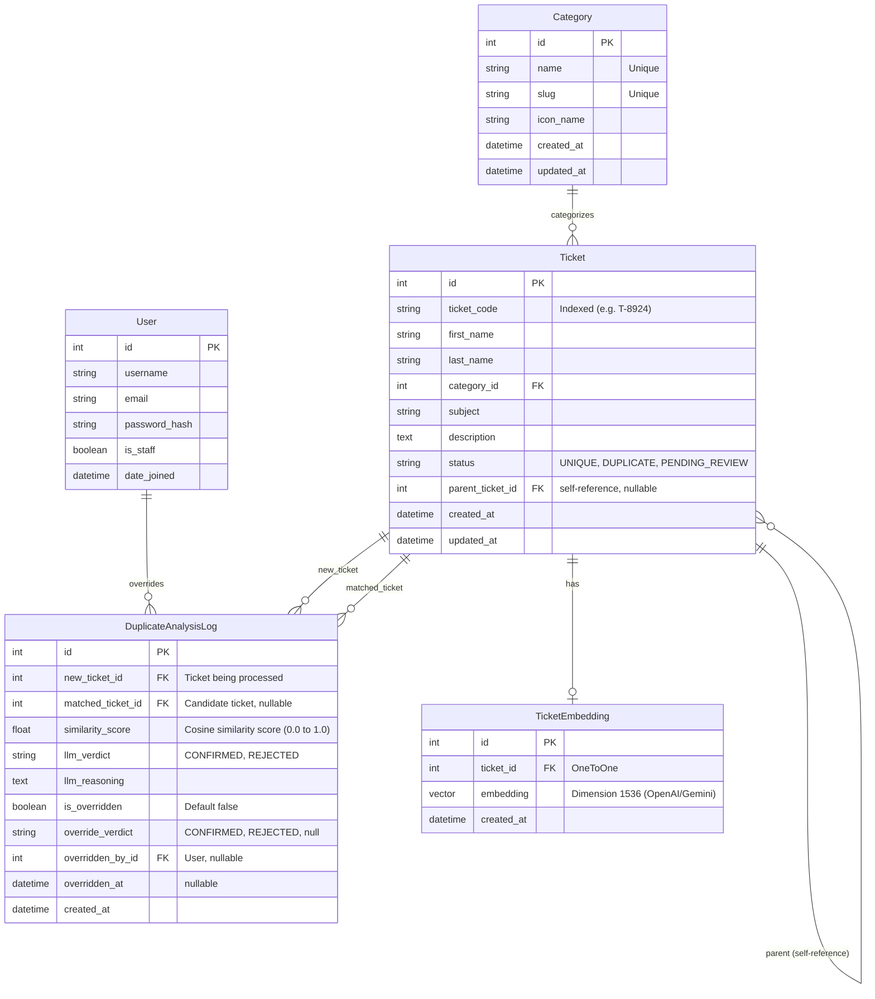
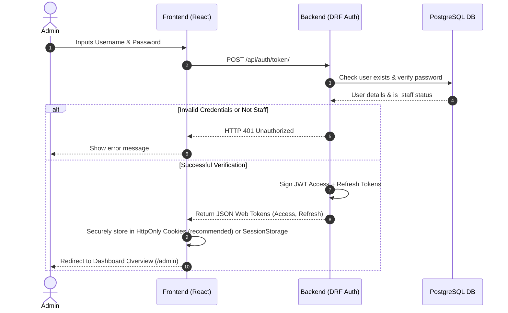
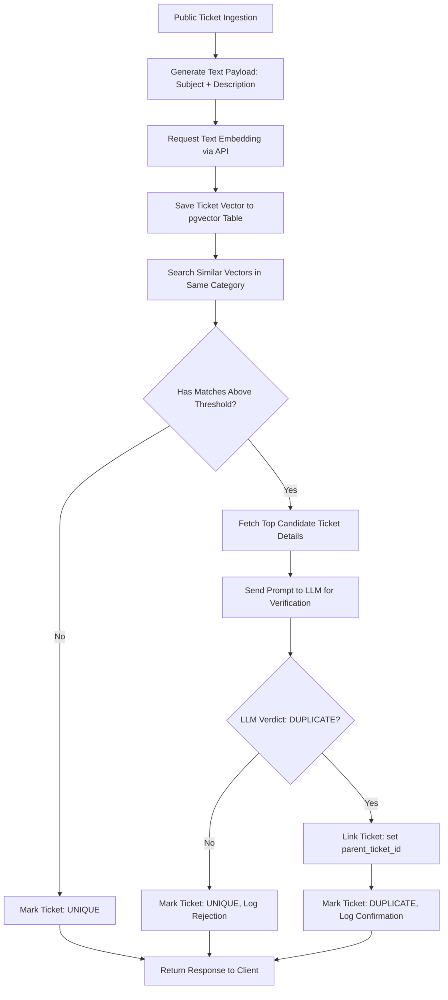

# Backend Architecture Document: AI-Powered Smart Issue Tracker with Ticket Deduplication

This document details the backend system design and architecture for the **AI-Powered Smart Issue Tracker with Ticket Deduplication**. The system is built on a Django REST Framework (DRF) backend with a PostgreSQL database using `pgvector` for similarity searches, combined with LLM verification for final duplicate confirmation.

---

## 1. UI Analysis & Feature Identification

Based on the React frontend components, pages, and layouts, we have identified the following system components and interactions:

### A. Pages / Screens
1. **Public Landing Page (`/`)**: Main entry point for end-users. Displays marketing sections and a self-service ticket submission area.
2. **Admin Login Page (`/admin/login` - Proposed)**: Secure login interface for staff/administrators (currently represented as a direct navbar link).
3. **Admin Layout Container (`/admin/*`)**: Standard navigation shell providing a sidebar and header for all administrative actions.
4. **Admin Dashboard Overview (`/admin`)**: Summary page containing system statistics, a processing volume chart, and recent deduplication activity.
5. **Previous Tickets Page (`/admin/tickets`)**: Log of all ingested tickets with search, filtering, and pagination support.
6. **Analysis History Page (`/admin/history`)**: Log of deduplication events showing similarity scores, LLM verdicts (Confirmed/Rejected), and decision paths.
7. **Categories Management Page (`/admin/categories`)**: Overview of active categories with total ticket volumes, duplicate ratios, and category-level configurations.
8. **Settings Page (`/admin/settings` - Placeholder)**: Configuration console for model thresholds, LLM settings, and administrative variables.

### B. Forms
1. **Ticket Submission Form (Public Landing Page)**:
   - **First Name** (`firstName`, Text, Required)
   - **Last Name** (`lastName`, Text, Required)
   - **Ticket Category** (`category`, Select Dropdown, Required)
   - **Subject** (`subject`, Text, Required)
   - **Issue Description** (`description`, Textarea, Required)
2. **Admin Login Form (Admin Login Page)**:
   - **Username / Email** (Text, Required)
   - **Password** (Password, Required)
3. **Add/Edit Category Form (Categories Page)**:
   - **Category Name** (Text, Required)
   - **Slug** (Text, Auto-generated, Unique)
   - **Icon Key** (Text/Select, e.g. "Key", "CreditCard", "Mail", "Shield", "HardDrive", "Package")
4. **Deduplication Settings Form (Settings Page)**:
   - **Vector Similarity Threshold** (Float Slider, Range: 0.0 - 1.0, e.g., default `0.85`)
   - **LLM Verification Model** (Select, e.g. `gemini-1.5-flash`, `gemini-2.0-flash`, `gpt-4o-mini`)
   - **Auto-Resolve Flag** (Toggle, whether LLM-confirmed duplicates are auto-closed/linked)

### C. Tables
1. **Tickets List Table (`/admin/tickets`)**:
   - **Columns**: Ticket ID (Code), Title (Subject), Category, Status (Unique / Duplicate / Pending Review), Date.
   - **Actions**: Global Search, Category/Status Filters, View Details, Paginate.
2. **Duplicate Analysis History Table (`/admin/history`)**:
   - **Columns**: New Ticket ID, Matched Ticket ID, Similarity Score (Progress Bar + Percentage), LLM Verdict (Confirmed / Rejected), Ingestion Date.
   - **Actions**: Search, Filter by Verdict/Score, View Reasoning/Logs, Override Verdict.

### D. Dashboard Cards
1. **Total Tickets**: Counter card showing lifetime tickets with a comparison to the previous month.
2. **Duplicate Matches**: Counter card showing total flagged duplicates with a comparison to the previous month.
3. **Categories**: Counter card showing count of active categories.
4. **Avg Similarity Score**: Numeric card showing average cosine similarity score of flagged matches.
5. **Processing Volume (7 Days)**: Area chart detailing daily counts of total tickets vs. duplicate matches.
6. **Recent Activity List**: Feed of the last 4-5 ingested tickets detailing: Ticket ID, Subject, Match ID, Similarity Score, Elapsed Time, Status.
7. **Category Card (Categories Page)**: Individual cards per category displaying Category Name, Icon, Total Tickets, Duplicates Count, Duplication Rate progress bar + percentage, and a settings shortcut.

### E. Filters & Search Fields
1. **Admin Header Search**: Top-navbar text input for global ID or ticket subject search.
2. **Tickets Page Toolbar**:
   - **Search Input**: Fuzzy text query targeting ticket subjects, descriptions, or IDs.
   - **Filters Button**: Opens criteria panel targeting Category, Status (Unique, Duplicate, Pending Review), and Date Range.
3. **Analysis History Toolbar**:
   - **Search Input**: Query matching Ticket IDs.
   - **Filters Button**: Filters by LLM Verdict (Confirmed, Rejected) and Similarity Score Range.

### F. User Actions
- Load landing page.
- Submit a support ticket.
- Navigate to the admin workspace.

### G. Admin Actions
- Authenticate / Logout.
- Review dashboard stats and daily volume trends.
- Browse, search, and filter previous tickets.
- View ticket details, description, and deduplication payload.
- Browse duplicate analysis logs.
- Manually override a machine classification (e.g. mark a confirmed duplicate as unique, or link an unlinked ticket).
- Add new categories.
- Modify category profiles and settings.

---

## 2. Complete Database Schema

To support vector similarity querying directly in the database, we use **PostgreSQL** with the `pgvector` extension. In Django, this integrates using the `pgvector.django` package.



### Table Definitions & Datatypes

#### 1. `auth_user` (Django Default / Custom User)
| Column | Datatype | Constraints | Notes |
| :--- | :--- | :--- | :--- |
| `id` | `INTEGER` | Primary Key, Auto Increment | |
| `username` | `VARCHAR(150)` | Unique | |
| `email` | `VARCHAR(254)` | | |
| `password` | `VARCHAR(128)` | | Salted hash |
| `is_staff` | `BOOLEAN` | | Determines admin access |
| `is_active` | `BOOLEAN` | | Active account flag |
| `date_joined` | `TIMESTAMP WITH TZ`| | Ingestion datetime |

#### 2. `tickets_category`
| Column | Datatype | Constraints | Notes |
| :--- | :--- | :--- | :--- |
| `id` | `INTEGER` | Primary Key, Auto Increment | |
| `name` | `VARCHAR(100)` | Unique, Not Null | e.g. "Authentication" |
| `slug` | `VARCHAR(100)` | Unique, Not Null, Index | e.g. "authentication" |
| `icon_name` | `VARCHAR(50)` | Not Null | Lucide icon name mapping |
| `created_at` | `TIMESTAMP WITH TZ`| Not Null, Auto Now Add | |
| `updated_at` | `TIMESTAMP WITH TZ`| Not Null, Auto Now | |

#### 3. `tickets_ticket`
| Column | Datatype | Constraints | Notes |
| :--- | :--- | :--- | :--- |
| `id` | `INTEGER` | Primary Key, Auto Increment | |
| `ticket_code` | `VARCHAR(20)` | Unique, Index, Not Null | Formatted code e.g. "T-8924" |
| `first_name` | `VARCHAR(100)` | Not Null | |
| `last_name` | `VARCHAR(100)` | Not Null | |
| `category_id` | `INTEGER` | FK -> `tickets_category.id`, Not Null | |
| `subject` | `VARCHAR(255)` | Not Null | |
| `description` | `TEXT` | Not Null | |
| `status` | `VARCHAR(20)` | Not Null, Default 'UNIQUE' | Choices: `UNIQUE`, `DUPLICATE`, `PENDING_REVIEW` |
| `parent_ticket_id`| `INTEGER` | FK -> `tickets_ticket.id`, Nullable | References original unique ticket |
| `created_at` | `TIMESTAMP WITH TZ`| Not Null, Auto Now Add, Index | |
| `updated_at` | `TIMESTAMP WITH TZ`| Not Null, Auto Now | |

#### 4. `tickets_ticketembedding`
| Column | Datatype | Constraints | Notes |
| :--- | :--- | :--- | :--- |
| `id` | `INTEGER` | Primary Key, Auto Increment | |
| `ticket_id` | `INTEGER` | OneToOne -> `tickets_ticket.id`, Not Null | |
| `embedding` | `vector(1536)` | Not Null | Dimension varies based on model |
| `created_at` | `TIMESTAMP WITH TZ`| Not Null, Auto Now Add | |

> [!NOTE]
> We will create an HNSW index on the `embedding` column using Cosine Distance operator `vector_cosine_ops` to enable rapid nearest-neighbor vector scans.

#### 5. `deduplication_duplicateanalysislog`
| Column | Datatype | Constraints | Notes |
| :--- | :--- | :--- | :--- |
| `id` | `INTEGER` | Primary Key, Auto Increment | |
| `new_ticket_id` | `INTEGER` | FK -> `tickets_ticket.id`, Not Null | Ingested ticket |
| `matched_ticket_id`| `INTEGER` | FK -> `tickets_ticket.id`, Nullable | Flagged duplicate candidate |
| `similarity_score`| `DOUBLE PRECISION`| Not Null | Cosine similarity value (0.0 to 1.0) |
| `llm_verdict` | `VARCHAR(20)` | Not Null | Choices: `CONFIRMED`, `REJECTED` |
| `llm_reasoning` | `TEXT` | Not Null | Reasoning generated by LLM |
| `is_overridden` | `BOOLEAN` | Not Null, Default `False` | Overridden flag |
| `override_verdict`| `VARCHAR(20)` | Nullable | Choices: `CONFIRMED`, `REJECTED`, `null` |
| `overridden_by_id`| `INTEGER` | FK -> `auth_user.id`, Nullable | Admin user who performed override |
| `overridden_at` | `TIMESTAMP WITH TZ`| Nullable | Timestamp of override |
| `created_at` | `TIMESTAMP WITH TZ`| Not Null, Auto Now Add, Index | |

---

## 3. Backend API Design

All admin endpoints (`/api/admin/*`) require standard authentication (JWT/Session). Public endpoints (`/api/tickets/*`) are accessible without authentication but are subject to rate limiting (throttling).

### A. Public Authentication / Registration (JWT)
- **POST** `/api/auth/token/`
  - *Description*: Authenticate admin and get JWT.
  - *Request Body*:
    ```json
    {
      "username": "admin",
      "password": "securepassword"
    }
    ```
  - *Response Body (200 OK)*:
    ```json
    {
      "access": "eyJhbGciOi...",
      "refresh": "eyJhbGciOi..."
    }
    ```
- **POST** `/api/auth/token/refresh/`
  - *Description*: Refresh access token.
  - *Request Body*:
    ```json
    {
      "refresh": "eyJhbGciOi..."
    }
    ```
  - *Response Body (200 OK)*:
    ```json
    {
      "access": "eyJhbGciOi..."
    }
    ```

### B. Public Ingestion
- **POST** `/api/tickets/`
  - *Description*: Ingest a new support ticket and run it through the deduplication pipeline.
  - *Request Body*:
    ```json
    {
      "first_name": "John",
      "last_name": "Smith",
      "category_slug": "authentication",
      "subject": "Unable to login to account",
      "description": "User receives authentication error while signing in."
    }
    ```
  - *Response Body (201 Created)*:
    ```json
    {
      "ticket_code": "T-8924",
      "status": "UNIQUE",
      "parent_ticket": null,
      "created_at": "2026-06-09T01:05:00Z"
    }
    ```

---

### C. Admin Dashboard
- **GET** `/api/admin/dashboard/stats/`
  - *Description*: Fetch summary stats for cards.
  - *Response Body (200 OK)*:
    ```json
    {
      "total_tickets": {
        "value": 12450,
        "change_percent": 12.0
      },
      "duplicate_matches": {
        "value": 3842,
        "change_percent": 5.0
      },
      "categories_count": {
        "value": 24,
        "change_percent": 0.0
      },
      "avg_similarity_score": {
        "value": 94.2,
        "change_percent": 1.2
      }
    }
    ```

- **GET** `/api/admin/dashboard/volume-chart/`
  - *Description*: Fetch last 7 days of processing metrics for charting.
  - *Response Body (200 OK)*:
    ```json
    [
      { "name": "Mon", "tickets": 120, "duplicates": 30 },
      { "name": "Tue", "tickets": 145, "duplicates": 45 },
      { "name": "Wed", "tickets": 130, "duplicates": 35 },
      { "name": "Thu", "tickets": 160, "duplicates": 50 },
      { "name": "Fri", "tickets": 150, "duplicates": 40 },
      { "name": "Sat", "tickets": 80, "duplicates": 15 },
      { "name": "Sun", "tickets": 90, "duplicates": 20 }
    ]
    ```

- **GET** `/api/admin/dashboard/recent-activity/`
  - *Description*: Fetch the top 4 recent processing activities.
  - *Response Body (200 OK)*:
    ```json
    [
      {
        "id": "T-8924",
        "title": "Cannot access billing portal",
        "match": "T-8810",
        "score": "98%",
        "time": "10 min ago",
        "status": "Duplicate"
      },
      {
        "id": "T-8925",
        "title": "Feature request: Dark mode",
        "match": null,
        "score": "-",
        "time": "15 min ago",
        "status": "Unique"
      }
    ]
    ```

---

### D. Admin Ticket Management
- **GET** `/api/admin/tickets/`
  - *Description*: List and filter ingested support tickets.
  - *Query Parameters*: `q` (fuzzy text search), `category` (slug), `status` (choices), `page` (int), `page_size` (int).
  - *Response Body (200 OK)*:
    ```json
    {
      "count": 12450,
      "next": "/api/admin/tickets/?page=2",
      "previous": null,
      "results": [
        {
          "ticket_code": "T-8924",
          "title": "Cannot access billing portal",
          "category": "Account Management",
          "status": "Duplicate",
          "date": "Oct 24, 2023"
        }
      ]
    }
    ```

- **GET** `/api/admin/tickets/<ticket_code>/`
  - *Description*: Fetch detailed information about a single ticket, including linked duplicate references.
  - *Response Body (200 OK)*:
    ```json
    {
      "ticket_code": "T-8924",
      "first_name": "John",
      "last_name": "Smith",
      "category": "Account Management",
      "subject": "Cannot access billing portal",
      "description": "User receives authentication error while signing in.",
      "status": "Duplicate",
      "parent_ticket": "T-8810",
      "created_at": "2026-06-09T01:05:00Z",
      "duplicate_tickets": [],
      "analysis_logs": [
        {
          "matched_ticket": "T-8810",
          "similarity_score": 0.985,
          "llm_verdict": "CONFIRMED",
          "llm_reasoning": "Both tickets report a login failure when attempting to view checkout pages."
        }
      ]
    }
    ```

- **DELETE** `/api/admin/tickets/<ticket_code>/`
  - *Description*: Delete/close a ticket.
  - *Response (204 No Content)*: Empty.

---

### E. Admin Analysis History & Override
- **GET** `/api/admin/history/`
  - *Description*: View similarity checking history and LLM results.
  - *Query Parameters*: `q` (text search by ticket code), `verdict` (`Confirmed`/`Rejected`), `page`.
  - *Response Body (200 OK)*:
    ```json
    {
      "count": 5,
      "results": [
        {
          "id": 102,
          "newTicket": "T-8924",
          "matchedTicket": "T-8810",
          "score": "98.5%",
          "verdict": "Confirmed",
          "reasoning": "Both tickets detail an error retrieving billing tokens...",
          "date": "Oct 24, 10:45 AM"
        }
      ]
    }
    ```

- **POST** `/api/admin/history/<log_id>/override/`
  - *Description*: Allow admins to override an LLM decision.
  - *Request Body*:
    ```json
    {
      "override_verdict": "REJECTED"
    }
    ```
  - *Response Body (200 OK)*:
    ```json
    {
      "log_id": 102,
      "newTicket": "T-8924",
      "matchedTicket": "T-8810",
      "score": "98.5%",
      "verdict": "Rejected (Overridden)",
      "overridden_by": "admin",
      "overridden_at": "2026-06-09T01:10:00Z"
    }
    ```

---

### F. Admin Category Management
- **GET** `/api/admin/categories/`
  - *Description*: List categories with duplication statistics.
  - *Response Body (200 OK)*:
    ```json
    [
      {
        "id": 1,
        "name": "Authentication",
        "slug": "authentication",
        "icon": "Key",
        "count": 3420,
        "dupes": 850
      }
    ]
    ```

- **POST** `/api/admin/categories/`
  - *Description*: Create a new category.
  - *Request Body*:
    ```json
    {
      "name": "Billing & Checkout",
      "icon": "CreditCard"
    }
    ```
  - *Response Body (201 Created)*:
    ```json
    {
      "id": 7,
      "name": "Billing & Checkout",
      "slug": "billing-checkout",
      "icon": "CreditCard",
      "count": 0,
      "dupes": 0
    }
    ```

- **DELETE** `/api/admin/categories/<id>/`
  - *Description*: Delete an existing category.
  - *Response (204 No Content)*: Empty.

---

## 4. Authentication Flow

Admin access is guarded by secure Token Authentication.



### Authorization Architecture Details
1. **JWT Lifespan**:
   - Access Token: `60 minutes`
   - Refresh Token: `7 days`
2. **Access Control**:
   - Every admin route request includes the token in the header: `Authorization: Bearer <access_token>`.
   - The views enforce permission check `IsAdminUser` (`is_staff = True`).
   - If an access token expires (resulting in `401 Unauthorized`), the Frontend automatically issues a request to `/api/auth/token/refresh/` using the stored refresh token to get a new access token without interrupting the user.

---

## 5. Ticket Lifecycle & Deduplication Flow

The deduplication pipeline represents the core smart functionality of the tracker. It utilizes vector embedding comparison for rapid filtering, followed by LLM analysis to verify duplicates.



### Step-by-Step Processing Pipeline

#### Step 1: Ingestion & Text Normalization
The ticket is saved to the database. The system concatenates the ticket `subject` and `description` to create a search payload.
*Example Payload*:
```text
Subject: Account locked out
Description: Tried signing in three times with my work credentials but kept getting error. Now my page says account is temporarily locked. Please assist.
```

#### Step 2: Vector Embedding Generation
The payload is sent to an embedding API (e.g. OpenAI `text-embedding-3-small` or Gemini `text-embedding-004`). The output is a high-dimensional vector.
- Save the vector inside the `TicketEmbedding` table.

#### Step 3: Vector Similarity Query (PostgreSQL pgvector)
We search the database for other tickets in the same category.
- **SQL Operator**: `<->` (Cosine Distance) is used.
- **Filtering**: We select candidate tickets where similarity `(1 - cosine_distance)` is greater than the configuration threshold (e.g. `0.85`).
- **SQL Query Sample**:
  ```sql
  SELECT ticket_id, (1 - (embedding <=> %s)) AS similarity
  FROM tickets_ticketembedding te
  JOIN tickets_ticket t ON te.ticket_id = t.id
  WHERE t.category_id = %s AND t.status = 'UNIQUE' AND te.ticket_id != %s
  ORDER BY embedding <=> %s
  LIMIT 5;
  ```

#### Step 4: LLM Verification (The Final Judge)
For the top similar candidate ticket, we format a prompt for the LLM to inspect semantic equivalency. This safeguards against "false positives" in vector search.
*Prompt Template*:
```text
You are a Senior Support Engineer triage system.
Compare the two support tickets below and verify if they are reporting the exact same root problem.

[Ticket A (Existing Ticket)]:
Subject: {matched_ticket.subject}
Description: {matched_ticket.description}

[Ticket B (New Ticket)]:
Subject: {new_ticket.subject}
Description: {new_ticket.description}

Are these two tickets reporting the same issue?
Provide your answer in the following JSON format:
{
  "is_duplicate": true/false,
  "verdict": "CONFIRMED" or "REJECTED",
  "reasoning": "A concise, single-sentence explanation of why they are or are not duplicates."
}
```

#### Step 5: State Transition & History Insertion
- **If LLM confirms**: The new ticket's status is set to `DUPLICATE`, and the `parent_ticket` field is linked to the matched ticket.
- **If LLM rejects**: The new ticket's status is set to `UNIQUE`.
- Regardless of the outcome, a log entry is written to `DuplicateAnalysisLog` for auditing.

#### Step 6: Admin Manual Override
Admins can inspect the audit trail. If the admin chooses to override the result:
- If overriding a "Duplicate" to "Unique": The `parent_ticket` field on the ticket is set to `null` and its status is updated to `UNIQUE`.
- If overriding a "Unique" to "Duplicate": The ticket's status is updated to `DUPLICATE` and its `parent_ticket` field is mapped to the chosen target ticket.

---

## 6. Folder Structure

We organize the Django backend with a modular layout, separating configuration, independent applications, utility modules, and services.

```text
backend/
├── manage.py
├── requirements.txt
├── Dockerfile
├── config/                         # Django project main directory
│   ├── __init__.py
│   ├── asgi.py
│   ├── wsgi.py
│   ├── urls.py                     # Main url router (includes app urls)
│   └── settings/                   # Splitted environment settings
│       ├── __init__.py
│       ├── base.py                 # Core configurations
│       ├── local.py                # Development configs (local DB, debug)
│       └── production.py           # Production configs (security headers, AWS DB)
│
├── apps/                           # Sub-applications folder
│   ├── __init__.py
│   │
│   ├── authentication/             # Handles Admin logins and credentials
│   │   ├── __init__.py
│   │   ├── apps.py
│   │   ├── models.py
│   │   ├── serializers.py
│   │   ├── urls.py
│   │   └── views.py
│   │
│   ├── tickets/                    # Manages categories and tickets
│   │   ├── __init__.py
│   │   ├── apps.py
│   │   ├── models.py               # Ticket & Category models
│   │   ├── serializers.py          # Ticket serialization logic
│   │   ├── urls.py                 # Ingestion and list endpoints
│   │   ├── views.py                # CRUD controller logic
│   │   └── services.py             # Ticket creation & field mapping services
│   │
│   └── deduplication/              # AI pipeline components
│       ├── __init__.py
│       ├── apps.py
│       ├── models.py               # DuplicateAnalysisLog model
│       ├── serializers.py
│       ├── urls.py                 # Audit trail & override endpoints
│       ├── views.py
│       ├── tasks.py                # Async celery tasks (optional queueing)
│       └── services.py             # Vector embedding generation & LLM prompts
│
└── utils/                          # Cross-app helpers
    ├── __init__.py
    ├── embedding_client.py         # Third-party embedding API client
    └── llm_client.py               # Third-party LLM API wrapper
```

---

## 7. Verification and Testing Plan

To ensure the backend meets performance and accuracy goals, we propose the following validation protocols:

### A. Automated Testing
- **Unit Tests**:
  - Test serializers, authentication views, and payload validator logic.
  - Test vector database mocks to confirm coordinate ingestion works without database network dependency.
- **Integration Tests**:
  - Mock third-party embedding calls and mock LLM outputs.
  - Confirm the pipeline moves a ticket from `UNIQUE` to `DUPLICATE` when a mock verification JSON returns `true`.
  - Confirm that manual overrides update DB states and wipe/set `parent_ticket` mappings accordingly.

### B. Manual / Quality Testing
- **Fuzzy Search Validation**: Insert mock data matching typical categories and test headers.
- **LLM Accuracy Testing**: Feed a test dataset of 20 ticket pairs (containing minor lexical differences but identical semantic roots) to observe embedding proximity and LLM verification accuracy. Adjust similarity thresholds accordingly.
